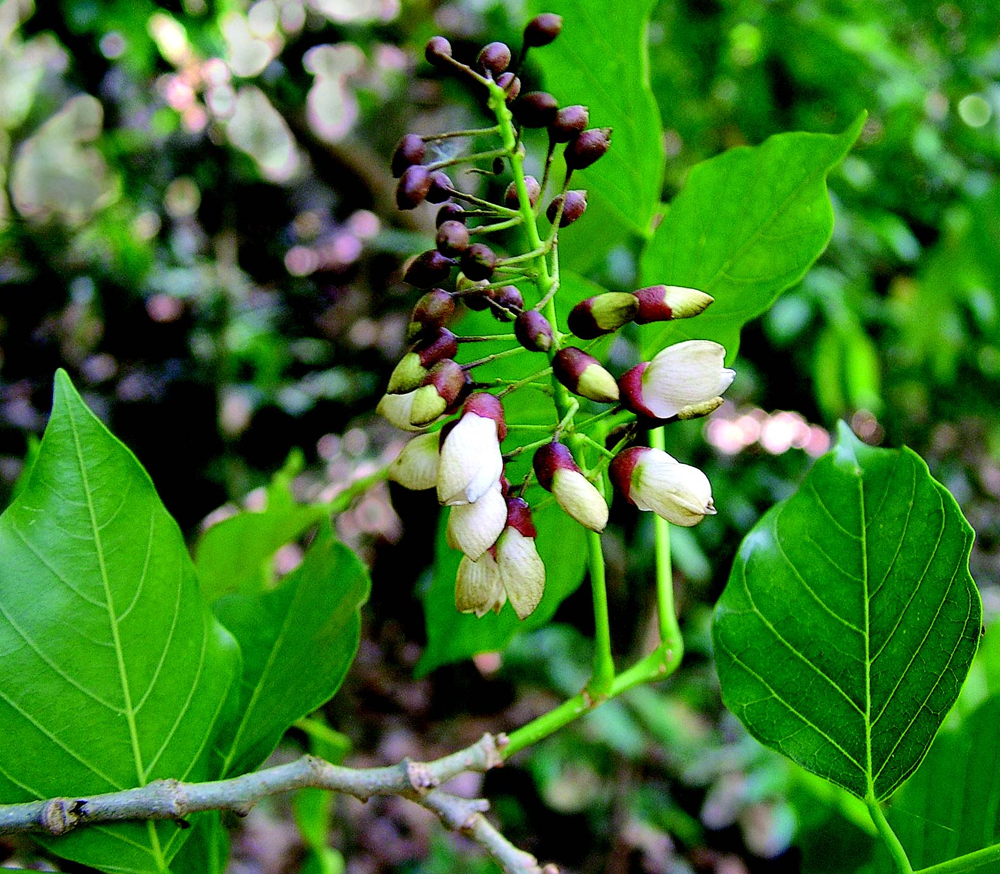
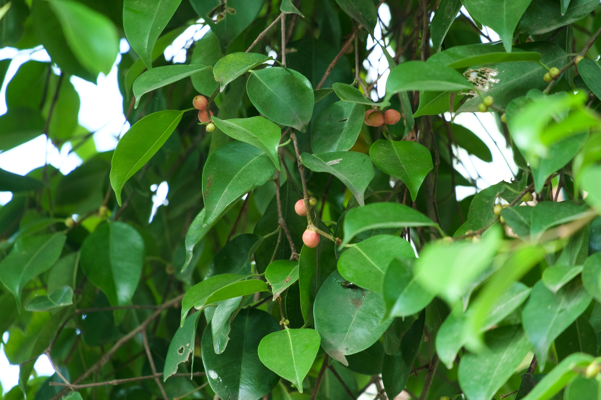
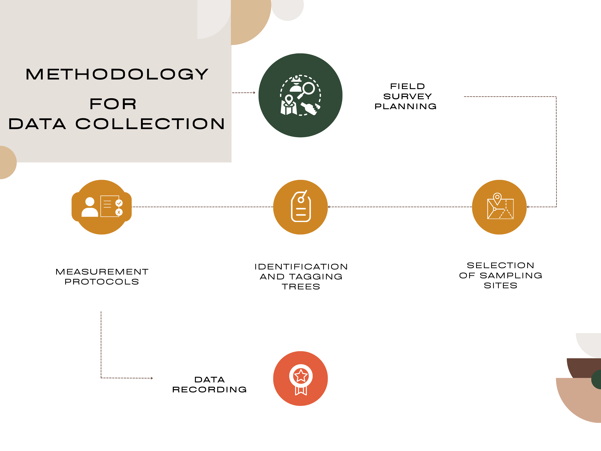
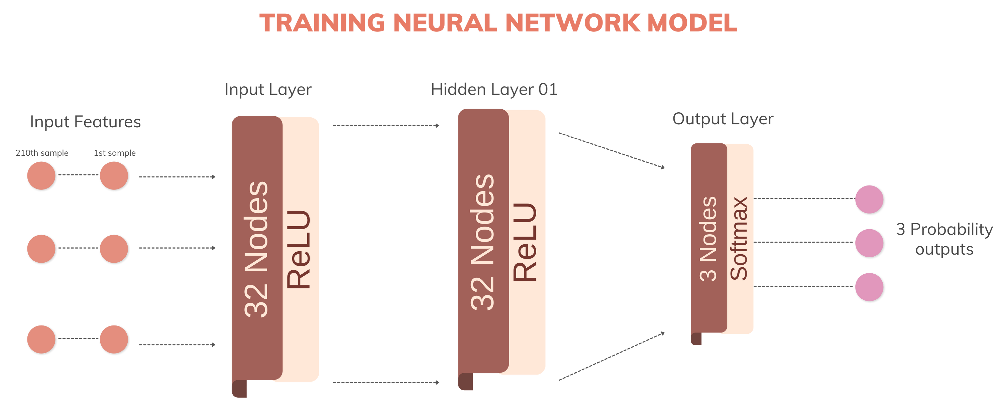
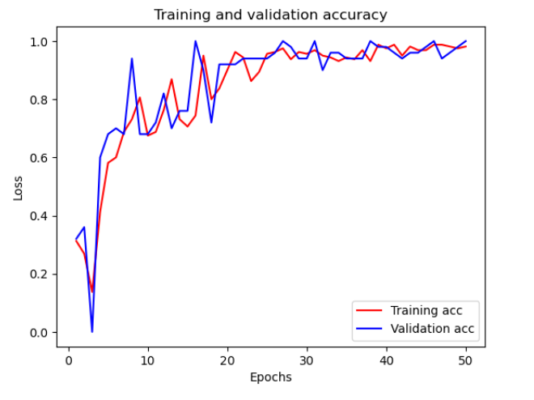
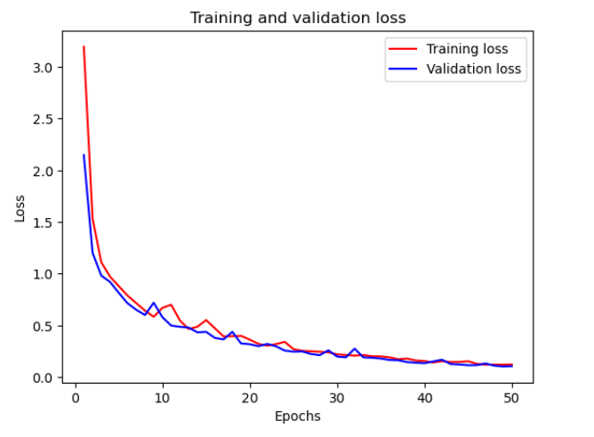
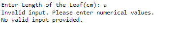
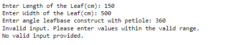
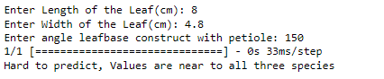

# Tree Species Classification in Rajarata University Garden

This repository contains the implementation and documentation for a project aimed at developing a neural network to classify three tree species found in a university garden: Millettia pinnata (Pongamia/Indian Beech), Bougainvillea glabra, and Ficus benjamina L. The project involves collecting physical measurements from these trees and using the data to train and test a neural network model.

#Group Details

Team Name: Project AI

Team members :
- A.M. Akhlak Hussain(Team Lead)
- P.P. Dissanayaka
- D.M. Asnaff


### Table of Contents

- [Introduction](#Introduction)
- [Overview of Selected Species](#Overview-of-Selected-Species)
- [Dataset Preparation](#Dataset-Preparation)
- [Details on the Training and Testing Datasets](#Details-on-the-Training-and-Testing-Datasets)
- [Architecture of the proposed Model](#Architecture-of-the-proposed-Model)
- [Training](#Training)
- [Hyper Parameters](#Hyper-Parameters)
- [Quantitative and Qualitative presentation](#Quantitative-and-Qualitative-presentation)
- [Highlighting both strength and limitations](#Highlighting-both-strength-and-limitations)
- [Summary of key Findings and their Implications](#Summary-of-key-Findings-and-their-Implications)

### Introduction

This project addresses the challenge of visually distinguishing between three similar tree species by using a neural network to classify them based on physical measurements.

### Overview of Selected Species

The project focuses on three tree species found in the university garden: Millettia pinnata, Bougainvillea glabra, and Ficus benjamina L. These species are visually similar, making them challenging to distinguish through observation alone.


#### Millettia pinnata Leaves


#### Bougainvillea glabra Leaves


#### Ficus benjamina L. Leaves



### Dataset Preparation

The methodology involves several key steps:


#### Methodology Used for Data Collection



1. **Field Survey**: Collecting physical measurements from the selected tree species.
2. **Selection of Sampling Sites**: The sites within the university garden where each of the three tree species is found.
3. **Identification and Tagging**: Trees were initially identified by our basic knowledge (for some trees there were QR codes
found in our university context) to ensure correct species identification.
4. **Measurement Protocols**: Leaf Length (cm): Distance from the base to the tip of the leaf.
Leaf Width (cm): Maximum width of the leaf.
Leaf Angle that constructs between leaf base and its petiole (Degree)
5. **Data Recording**: All measurements were manually recorded in a field notebook and later transferred to an
electronic spreadsheet for analysis.

### Details on the Training and Testing Datasets

- Measurements Per Tree: 100 leaves per tree
Total Leaf Measurements: 100 leaves/species × 3 species = 300 leaf samples

- Dataset Features
For each leaf sample:
• Leaf Length (cm)
• Leaf Width (cm)
• Leaf Angle that constructs between leaf base and its petiole (Degree)

- Training Set: 70% of the total samples (0.7 × 300 = 210 leaf samples)
- Testing Set: 30% of the total samples (0.3 × 300 = 90 leaf samples)

### Architecture of the proposed Model

The neural network architecture includes:

- **Input Layer**: 32 units with ReLU activation
- **Hidden Layer**: 32 units with ReLU activation
- **Output Layer**: 3 units with softmax activation



### Training : Description of the training process, including the implementation platform.

**Platform** - Jupyter Notebook
**Tools & Libraries** - TensorFlow, Matplotlib, NumPy, Pandas

**Hardware Specifications**
**CPU** - AMD Ryzen 7
**RAM** - 16GB

### Hyper Parameters

- Number of Layers - 3 Dense Layers
- Number of Nodes in Each Layer - 32, 32, 3 Units
- Activation Functions - ReLU, Softmax
- Optimizer - Adam
- Learning Rate - Default (0.001)
- Loss Function - categorical_crossentropy
-  Mini-Batch Size - 10
- Prediction Theshold - Probability Value > 5.1


### Quantitative and Qualitative presentation

### - Quantitative Results

### Training and Validation Accuracy



### Training and Validation Loss



### - Qualitative Results

### -Error handlings






### Highlighting both strength and limitations

### Summary of key Findings and their Implications

To use this repository, follow these steps:

1. **Clone the Repository**:
   ```bash
   git clone https://github.com/DmAsnaff/Tree_Classification_Model_ProjectAI.git
